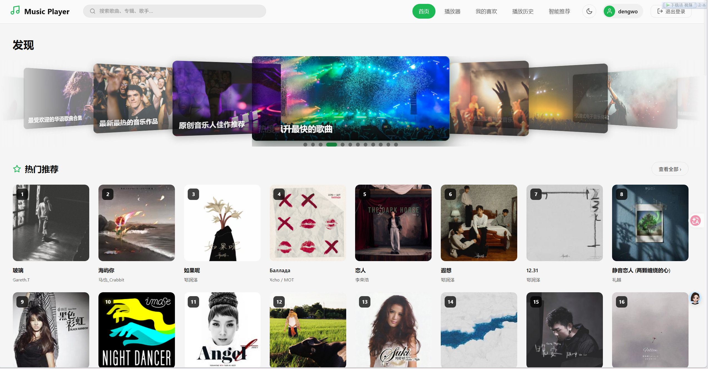
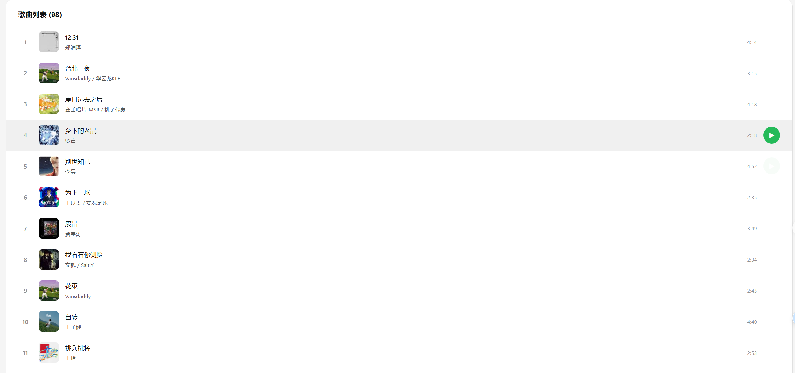
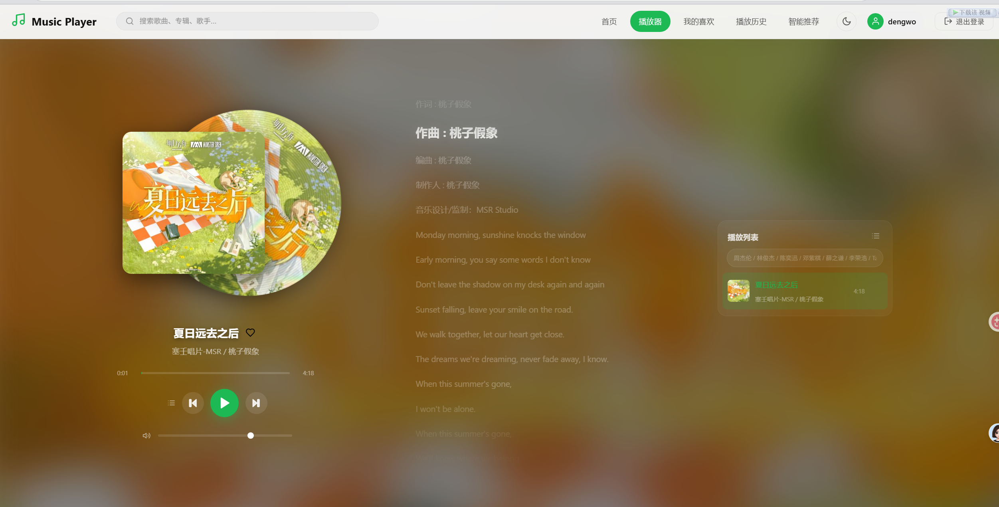

<<<<<<< HEAD
# 🎵 React Music Player

一个基于 React 18 + Vite 构建的在线音乐播放器，支持音乐搜索、在线播放、歌词显示、歌单/专辑/艺人浏览、收藏和历史记录等功能。
 
--------
    
## ✨ 功能特性

- 🔍 **多平台音乐搜索** — 支持网易云音乐、QQ 音乐等平台搜索
- 🎧 **在线播放** — 多音源自动切换，保障播放成功率
- 📝 **歌词同步** — 实时歌词展示
- 📋 **歌单 / 专辑 / 艺人** — 浏览热门歌单、最新专辑、热门艺人
- ❤️ **收藏管理** — 收藏喜欢的歌曲（本地存储）
- 📜 **播放历史** — 自动记录听歌历史（最多 50 条）
- 🤖 **AI 智能推荐** — 基于听歌历史，通过大模型生成个性化推荐
- 🌗 **主题切换** — 支持明暗主题
- 🔐 **用户系统** — 本地注册/登录（数据存储在浏览器本地）
- 🎨 **Mini 播放器** — 固定在底部，随时控制播放

---

## 🛠️ 技术栈

| 类别 | 技术 |
|------|------|
| 框架 | React 18 |
| 构建工具 | Vite 4 |
| 路由 | React Router v6 |
| 样式 | 原生 CSS |
| API 代理 | Vite Proxy |
| 音源 | 网易云音乐 / QQ音乐 / LX Music |
| AI | 阿里云百炼大模型 (DashScope) |

---

## 🚀 启动方式

### 环境要求

- **Node.js** >= 16.0.0（推荐 18+）
- **npm** >= 8.0.0

### 安装依赖

```bash
npm install
```

### 配置 API Key（AI 推荐功能）

项目中的 `.env.example` 是环境变量模板，复制并填入你自己的 Key：

```bash
cp .env.example .env
```

然后编辑 `.env` 文件，将 `your_api_key_here` 替换为你的**阿里云百炼 DashScope API Key**：

```
VITE_ALIYUN_API_KEY=sk-你的真实key
```

> 📌 获取 Key：前往 [阿里云百炼控制台](https://dashscope.console.aliyun.com/apiKey) 创建 API Key。
>
> 📌 如果不使用 AI 推荐功能，可以跳过此步骤，其他功能不受影响。

### 启动开发服务器

```bash
npm run dev
```

浏览器会自动打开 `http://localhost:3000`。

> ⚠️ 注意：`package.json` 中定义的启动脚本是 `dev`，请使用 `npm run dev`，而非 `npm start`。

### 构建生产版本

```bash
npm run build
```

构建产物在 `dist/` 目录。

### 预览生产版本

```bash
npm run preview
```

---

## ⚠️ 免责声明

1. **仅供学习交流** — 本项目仅用于个人学习、研究和交流，不得用于任何商业用途。

2. **音乐版权** — 本项目中播放的音乐内容来源于第三方平台（网易云音乐、QQ 音乐等），版权归原作者及版权方所有。请支持正版音乐。

3. **API 使用** — 本项目通过 Vite 代理转发第三方 API 请求，不存储任何音乐文件。若相关平台接口变更或限制访问，部分功能可能受影响。

4. **AI 服务** — AI 推荐功能使用阿里云百炼大模型 API，调用可能产生费用。项目代码中如包含 API Key 等敏感信息，**请务必在使用前替换为你自己的 Key**，避免泄露造成损失。

5. **用户数据** — 本项目的用户注册/登录数据、收藏记录等均存储在浏览器本地（localStorage/sessionStorage），不会上传至任何服务器。清除浏览器数据将导致这些信息丢失。

6. **风险提示** — 使用者应遵守相关法律法规及第三方平台的服务条款，因使用本项目产生的任何法律风险和责任由使用者自行承担。

---

## 📁 项目结构

```
src/
├── api/              # API 请求层（音乐搜索、歌词、音源解析等）
│   ├── music.js      # 网易云音乐 API
│   ├── sources.js    # 多音源管理
│   ├── lxsource.js   # LX Music 音源
│   ├── cache.js      # 请求缓存
│   └── ai.js         # AI 推荐接口
├── components/       # 公共组件
│   ├── Navbar.jsx    # 导航栏
│   ├── Player.jsx    # 播放器
│   ├── MiniPlayer.jsx# 底部迷你播放器
│   ├── Lyrics.jsx    # 歌词展示
│   └── Icons.jsx     # 图标组件
├── context/          # React Context
│   ├── AuthContext.jsx   # 用户认证
│   ├── PlayerContext.jsx # 播放器状态管理
│   └── ThemeContext.jsx  # 主题切换
├── pages/            # 页面组件
│   ├── Login.jsx     # 登录
│   ├── Register.jsx  # 注册
│   ├── HomePage.jsx  # 首页（热门推荐）
│   ├── PlayerPage.jsx# 播放页
│   ├── BrowsePage.jsx# 发现/浏览
│   ├── ArtistPage.jsx# 艺人详情
│   ├── PlaylistPage.jsx# 歌单详情
│   ├── FavoritesPage.jsx# 我的收藏
│   ├── HistoryPage.jsx  # 播放历史
│   └── RecommendPage.jsx# AI 推荐
├── App.jsx           # 根组件（路由定义）
├── main.jsx          # 入口文件
└── index.css         # 全局样式
```

---

## 📸 项目截图









---


## 📄 License

仅供学习交流使用。
